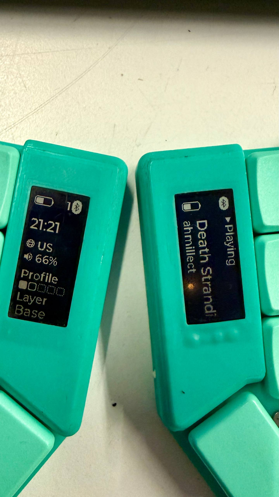

# ZMK Split HID Display

ZMK Split HID Display is a packaged ZMK module for split keyboards with
nice!view displays. The central half receives host data over Raw HID, forwards
it to the peripheral over ZMK split BLE, and both halves render the same current
host state.

<p align="center">
  
</p>

The module combines:

- Raw HID host transport for time, volume, layout, artist, and title payloads.
- A split output relay extended to carry arbitrary small messages between
  central and peripheral halves.
- A nice!view status screen for the central half.
- A nice!view media screen for the peripheral half, including stable text
  baseline rendering and a configurable marquee loop pause.
- Adapter shields so the module can be enabled from a normal ZMK `build.yaml`.

## What It Shows

The central half shows keyboard and host status:

- Battery and charging state.
- Current transport/profile state.
- Host time.
- Host layout label.
- Host volume.
- BLE profile dots.
- Active layer.

The peripheral half shows media state:

- Battery and split link state.
- Playing/offline state.
- Artist.
- Track title.
- Scrolling text when artist or title is wider than the display.

## Credits

This module is an integration and fork of work from the ZMK community:

- nice!view display UI and all Raw HID-related module work are based on
  [zzeneg/zmk-nice-view-hid](https://github.com/zzeneg/zmk-nice-view-hid).
- Split peripheral output relay support is based on
  [badjeff/zmk-split-peripheral-output-relay](https://github.com/badjeff/zmk-split-peripheral-output-relay).
- Battery icons and BLE states are based on
  [kevinpastor/nice-view-elemental](https://github.com/kevinpastor/nice-view-elemental)

The relay in this module has been extended for this keyboard use case: instead
of only sending a simple output value such as a motor or haptic signal, it can
send channel-addressed payload messages between the central and peripheral.

## How The Data Flows

```text
host app
  -> Raw HID report over USB or BLE HID
  -> ZMK central half
  -> split output relay channel
  -> ZMK peripheral half
  -> local Raw HID event
  -> nice!view widgets on both halves
```

The central still handles the host-facing Raw HID device. When a host report
arrives, `split_bridge.c` forwards only the logical payload length needed for
the message type. If the payload is larger than the safe BLE attribute payload,
it is split into sequence/offset/total chunks. The peripheral reassembles those
chunks and emits the same Raw HID event path used by the central UI.

## Quick Setup

### 1. Add The Module To `config/west.yml`

```yaml
manifest:
  remotes:
    - name: zmkfirmware
      url-base: https://github.com/zmkfirmware
    - name: oleksandrmaslov
      url-base: https://github.com/oleksandrmaslov
  projects:
    - name: zmk
      remote: zmkfirmware
      revision: main
      import: app/west.yml
    - name: zmk-split-hid-display
      remote: oleksandrmaslov
      revision: main
  self:
    path: config
```

Then update modules:

```sh
west update
```

### 2. Add The Adapter Shields To `build.yaml`

Keep your normal keyboard shield names and add both adapter shields:

```yaml
include:
  - board: nice_nano
    shield: corne_left nice_view_adapter nice_view_hid_adapter raw_hid_adapter

  - board: nice_nano
    shield: corne_right nice_view_adapter nice_view_hid_adapter raw_hid_adapter
```

For a custom shield, keep your custom left/right names:

```yaml
include:
  - board: nice_nano//zmk
    shield: corne_widgets_left nice_view_adapter nice_view_hid_adapter raw_hid_adapter

  - board: nice_nano//zmk
    shield: corne_widgets_right nice_view_adapter nice_view_hid_adapter raw_hid_adapter
```

Use the same board spelling your ZMK config already uses. Older configs may use
`nice_nano_v2`; newer configs often use `nice_nano//zmk`.

See [`examples/build.yaml`](examples/build.yaml) for a minimal matrix.

### 3. Enable The Module Features

Add the display and Raw HID options to your keyboard or shield config:

```conf
CONFIG_ZMK_DISPLAY=y
CONFIG_NICE_VIEW_HID=y
CONFIG_RAW_HID=y
CONFIG_RAW_HID_REPORT_SIZE=32

CONFIG_RAW_HID_FORWARD_TO_PERIPHERAL=y
CONFIG_RAW_HID_SPLIT_RELAY_CHANNEL=1
CONFIG_ZMK_SPLIT_PERIPHERAL_OUTPUT_MAX_PAYLOAD=64

CONFIG_NICE_VIEW_HID_MEDIA_SCROLL=y
CONFIG_NICE_VIEW_HID_MEDIA_SCROLL_INTERVAL_MS=350
CONFIG_NICE_VIEW_HID_MEDIA_SCROLL_START_PAUSE_STEPS=3
CONFIG_NICE_VIEW_HID_MEDIA_SCROLL_END_PAUSE_STEPS=10
CONFIG_NICE_VIEW_HID_MEDIA_SCROLL_MIN_BATTERY=25

CONFIG_NICE_VIEW_HID_LAYOUTS="us,ru,de,ua"
```

See [`examples/split-hid-display.conf`](examples/split-hid-display.conf).

### 4. Add The Relay Node On Both Halves

Each split-half overlay needs a relay node. The `relay-channel` value must match
`CONFIG_RAW_HID_SPLIT_RELAY_CHANNEL`.

```dts
/ {
    rawhid_or: rawhid_or {
        compatible = "zmk,split-peripheral-output-relay";
        relay-channel = <1>;
        device = <&nice_view>;
    };
};
```

See [`examples/split-hid-display.overlay`](examples/split-hid-display.overlay).

### 5. Send Data From The Host

Use a companion host app that can open the Raw HID interface and send reports.
The intended companion app is
[zzeneg/qmk-hid-host](https://github.com/zzeneg/qmk-hid-host).

The keyboard Raw HID interface uses:

- Usage page: `0xFF60`
- Usage: `0x61`
- Report size: `CONFIG_RAW_HID_REPORT_SIZE`, default `32`

The companion app is expected to send these message IDs:

| ID | Payload | Meaning |
| --- | --- | --- |
| `0xAA` | `0xAA, hour, minute` | Host time |
| `0xAB` | `0xAB, volume` | Host volume, 0-100 |
| `0xAC` | `0xAC, layout_index` | Layout index into `CONFIG_NICE_VIEW_HID_LAYOUTS` |
| `0xAD` | `0xAD, length, text...` | Media artist |
| `0xAE` | `0xAE, length, text...` | Media title |

Text payloads are UTF-8 and are clipped to the configured Raw HID report size.

## Output Relay Changes

The original split peripheral output relay was useful for simple output signals.
This module keeps that behavior but extends the relay into a small generic
message pipe:

- Relay events now include `relay_channel`, `value`, `payload_size`, and
  `payload[]`.
- `CONFIG_ZMK_SPLIT_PERIPHERAL_OUTPUT_MAX_PAYLOAD` controls the maximum payload
  buffer size.
- `zmk_split_bt_invoke_output_channel()` can send directly to a relay channel
  without requiring a physical output device lookup on the central.
- The central writes only the populated GATT value length instead of always
  sending a full fixed-size event.
- The peripheral validates GATT write length and copies only the provided
  payload bytes.
- The peripheral still maps relay channels back to virtual output devices for
  existing output-style use cases.
- Raw HID forwarding uses relay channel `CONFIG_RAW_HID_SPLIT_RELAY_CHANNEL`.
- Long Raw HID payloads are chunked with sequence, offset, and total length
  metadata, then reassembled on the peripheral before raising a local Raw HID
  event.

This is what lets the central send media/title/layout messages to the
peripheral, not just a single motor-style value.

## Display Behavior

The peripheral media view uses a temporary text canvas and copies a fixed font
line height into the rotated portrait canvas. That keeps the track line visually
stable when glyphs have different ascenders or descenders.

Long media strings use a character-window marquee:

- `CONFIG_NICE_VIEW_HID_MEDIA_SCROLL_START_PAUSE_STEPS` pauses at the beginning.
- `CONFIG_NICE_VIEW_HID_MEDIA_SCROLL_END_PAUSE_STEPS` leaves a blank gap before
  the loop restarts.
- `CONFIG_NICE_VIEW_HID_MEDIA_SCROLL_INTERVAL_MS` controls tick speed.
- `CONFIG_NICE_VIEW_HID_MEDIA_SCROLL_MIN_BATTERY` disables scrolling below a
  battery threshold unless charging.

## Configuration Reference

| Name | Description | Default |
| --- | --- | --- |
| `CONFIG_RAW_HID` | Enable Raw HID transport | `n` |
| `CONFIG_RAW_HID_USAGE_PAGE` | HID usage page | `0xFF60` |
| `CONFIG_RAW_HID_USAGE` | HID usage | `0x61` |
| `CONFIG_RAW_HID_REPORT_SIZE` | Raw HID report size in bytes | `32` |
| `CONFIG_RAW_HID_DEVICE` | USB HID device binding used for Raw HID | `HID_1` |
| `CONFIG_RAW_HID_FORWARD_TO_PERIPHERAL` | Forward central Raw HID reports to split peripherals | `y` when split relay is enabled |
| `CONFIG_RAW_HID_SPLIT_RELAY_CHANNEL` | Relay channel for Raw HID forwarding | `1` |
| `CONFIG_ZMK_SPLIT_PERIPHERAL_OUTPUT_MAX_PAYLOAD` | Max relay payload bytes | `32` |
| `CONFIG_ZMK_SPLIT_SPLT_PERIPHERAL_OUTPUT_QUEUE_SIZE` | Peripheral output queue depth | `5` |
| `CONFIG_NICE_VIEW_HID` | Enable the custom nice!view status screen | `n` |
| `CONFIG_NICE_VIEW_HID_TWO_PROFILES` | Limit displayed profiles to two | `n` |
| `CONFIG_NICE_VIEW_HID_SHOW_LAYOUT` | Show host layout name | `y` |
| `CONFIG_NICE_VIEW_HID_LAYOUTS` | Comma-separated layout names | `EN` |
| `CONFIG_NICE_VIEW_HID_INVERTED` | Invert display colors | `n` |
| `CONFIG_NICE_VIEW_HID_MEDIA_SCROLL` | Scroll overflowing media text | `y` |
| `CONFIG_NICE_VIEW_HID_MEDIA_SCROLL_INTERVAL_MS` | Media scroll interval in milliseconds | `350` |
| `CONFIG_NICE_VIEW_HID_MEDIA_SCROLL_START_PAUSE_STEPS` | Scroll ticks to pause at text start | `3` |
| `CONFIG_NICE_VIEW_HID_MEDIA_SCROLL_END_PAUSE_STEPS` | Blank scroll ticks between loop end and restart | `10` |
| `CONFIG_NICE_VIEW_HID_MEDIA_SCROLL_MIN_BATTERY` | Minimum battery percentage for scrolling unless charging | `25` |

## Troubleshooting

If the central updates but the peripheral does not:

- Confirm both halves include the relay node.
- Confirm both halves use the same `relay-channel`.
- Confirm `CONFIG_RAW_HID_FORWARD_TO_PERIPHERAL=y`.
- Confirm the peripheral is connected to the central split link.

If the Raw HID interface is missing:

- Confirm `raw_hid_adapter` is in the shield list.
- Confirm `CONFIG_RAW_HID=y`.
- Confirm your board config allows a second USB HID device.

If media text does not scroll:

- Confirm `CONFIG_NICE_VIEW_HID_MEDIA_SCROLL=y`.
- Confirm the text is wider than the display run.
- Check `CONFIG_NICE_VIEW_HID_MEDIA_SCROLL_MIN_BATTERY`; scrolling pauses below
  the threshold unless charging.

## License

MIT. See [`LICENSE`](LICENSE).
